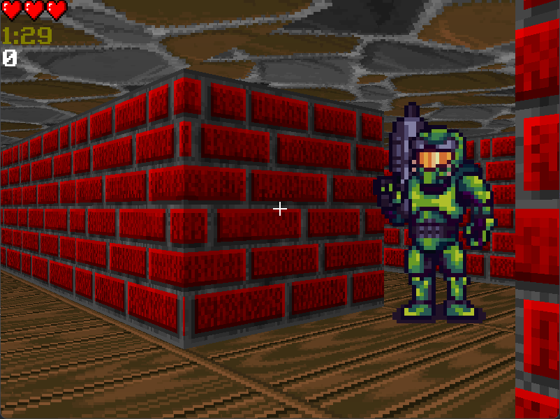

# Chaos Corridors

Welcome to **Chaos Corridors**, A Doom-style multiplayer game where you run around in a random maze and shoot your friends to get the most points!

## Gameplay

The game is 3 minutes long. You spawn in a random location in a random maze, and your objective is to find other players and eliminate them. Every player has 3 hearts, and when they get shot they lose 1 heart. When they don't have anymore hearts, they respawn in a new location, and the player that eliminated them gets 100 points.

### Controls

 - WASD - Movement
 - Mouse - Looking Around
 - Left Mouse Button - Shooting

### Ending

The game ends after 3 minutes. The player(s) with the most points wins!

## Protocol

The game networking is on 2 channels:
 - TCP - For information like player got hit, start game, end game, update timer, update score, and player spawn/respawn.
 - UDP - For information like player movement and shooting.

The server opens a thread for each connection and receives TCP messages from each client on its thread.

### TCP Protocol

TCP messages are in the form of `key:value\r` (`\r` is Carriage Return).

#### Types of keys:

 - `player`: This message is sent from the client to the server when they are connecting, and from the server to the client everytime another player connects. The value of this message is the player's username. For example: `player:yoyo\r`.
 - `udp`: This message is sent from the client to the server when they are connecting, and its value is the client's UDP port. For example: `udp:54321\r`.
 - `index`: This message is sent from the server to the client when they are connecting, and it contains the player's index during the game. For example: `index:1\r`.
 - `soon`: This message is sent from the server to all clients when the all the players are connected and the game is starting soon. It contains no value. For example: `soon:\r`.
 - `close`: This message is sent from the client to the server when the client leaves the game, and it contains no value. For example: `close:\r`.
 - `hit`: This message is sent from the server to the client that got hit, and it contains no value. For example: `hit:\r`.
 - `score`: This message is sent from the server to the client when they eliminated another player, and its value is how many points the player receives. For example: `score:100\r`.
 - `init`: This message is sent from the server to the client when a player spawns/respawns. Its value is the player's index, x coord, and y coord, seperated by spaces. For example: `init:1 4.5 6.5\r`.
 - `exit`: This message is sent from the server to all clients when a player disconnects, the value is the disconnected player's index. For example: `exit:2\r`.
 - `end`: This message is sent from the server to all clients when the game ends, and its value is a string that says who won. For example: `end:yoyo won!\r`.

### UDP Protocol

UDP packets are in binary form, and are represented by the struct `protocol::Packet`. `Packet` has 4 fields, although different types of packets don't use all of them:
 - `type`: An enum (1 byte) that contains the type of the packet: `NO_PACKET`, `UPDATE_PLAYER`, `UPDATE_BULLET`, `CLEAR_BULLETS`.
 - `index`: An integer (4 bytes) that contains the index of the player/bullet.
 - `position`: A Vector2f (two floats - 8 bytes) that contains the position of the player/bullet.
 - `direction`: A float (4 bytes) that contains the direction of the bullet.

#### Types of packets:

 - `NO_PACKET`: No packet was sent, happens when the socket has no packets to receive.
 - `UPDATE_PLAYER`: Sent from clients to the server 30 times per second. `index` is the player's index, `position` is the player's position, and `direction` is ignored.
 - `UPDATE_BULLET`: Sent from clients to the server when the client shoots, and from the server to the clients to update all bullets. `position` is the bullet's position. When sent from the client, `index` is the shooting player's index, and `direction` is the direction of the bullet. When sent from the server, `index` is the bullet's index, and `direction` is ignored.
 - `CLEAR_BULLETS`: Sent from the server to the client before sending the updated bullets information. `index`, `position` and `direction` are ignored.

### Sequence Diagram

## Project Architecture

The game is written in C++ using SFML. Currently it can only run on windows due to it using the Winsock API. It contains 4 projects:

1. `Game`: This is what the client runs, and it contains the game itself.
2. `Server`: The server.
3. `Globals`: Constants, classes and functions that both the client and the server need.
4. `Sockets`: A wrapper on the C socket library to organize it in classes.

## Building and running

To edit the code and build the project, clone the repository and open it in Visual Studio 2022.

If you just want to play the game, download it from the Releases tab in GitHub, run the server, get some friends and enjoy!